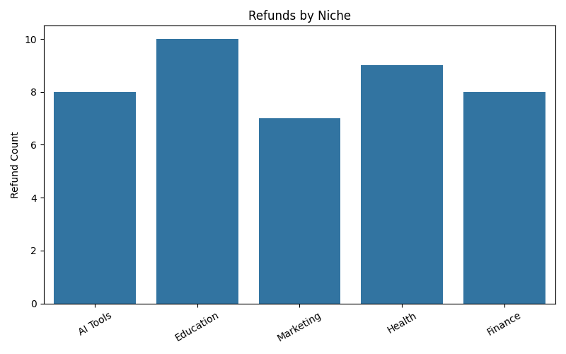
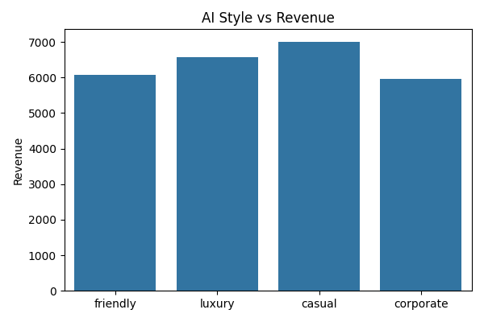
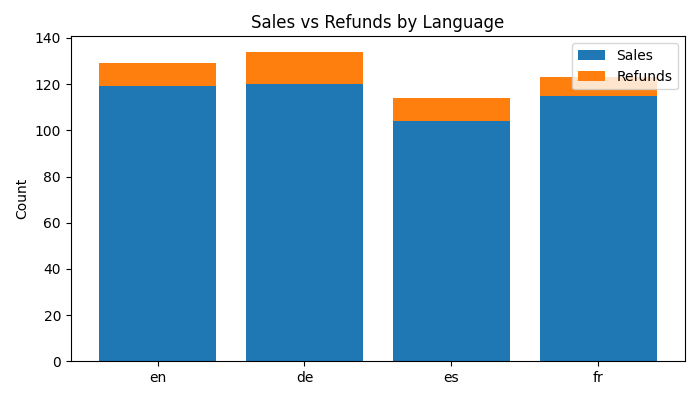
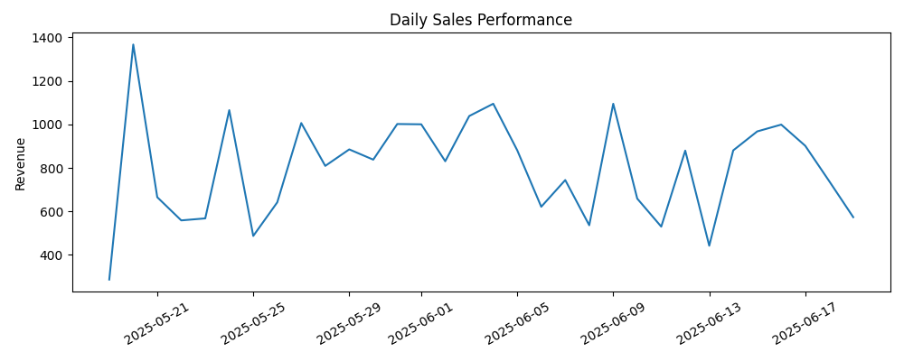
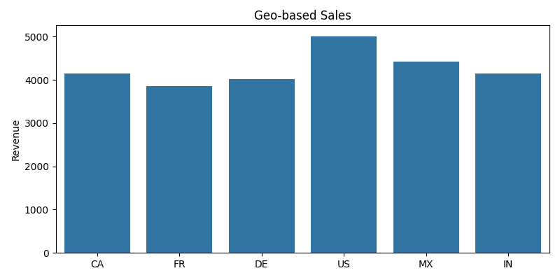
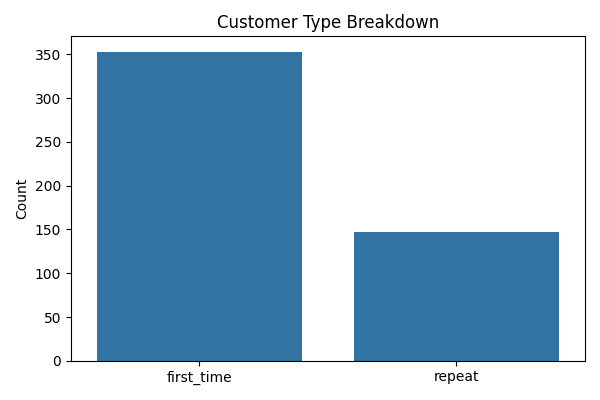

# Advanced Analytics Dashboard

AIFOLIO™ analytics provide deep insights into all aspects of your business and AI operations, fully aligned with WINDSURF priorities.

## 📊 Metrics Tracked
- **Vault revenue breakdown** (per vault, niche, product, AOV)
- **Refund metrics** (per vault, niche, reason, timeline)
- **Top-performing niches** (gross revenue, conversions, profit after refunds)
- **AI generation success rate** (success/fail, latency, AI version)
- **Vault conversion funnel** (visits → cart → purchase → refund)
- **AI style vs revenue impact**
- **Multi-language sales vs refunds**
- **Sales performance over time** (daily, weekly, hourly trends)
- **Geo-based sales data** (country, region)
- **AI prompt version tracking per sale**
- **Delivery status** (email/receipt sent success)
- **Customer type** (first-time vs repeat)

## 🗂️ Analytics Log Schema
Each analytics log entry contains:

| Field                | Example                  | Description                         |
|----------------------|-------------------------|-------------------------------------|
| vault_id             | vault_3                 | Vault identifier                    |
| niche                | "AI Tools"              | Niche/category                      |
| product_name         | "AI Tools Toolkit"      | Product name                        |
| ai_prompt_version    | v2                      | AI prompt version                   |
| ai_style             | corporate               | AI writing style                    |
| ai_generation_success| true                    | AI generation success/fail          |
| ai_latency           | 1.23                    | AI generation latency (sec)         |
| ai_version           | gpt-4                   | AI backend/version                  |
| sale_datetime        | 2025-06-19T15:04:32     | Sale date/time (ISO)                |
| sale_amount          | 49.99                   | Sale amount (USD)                   |
| refund               | false                   | Was this refunded?                  |
| refund_reason        | ""                      | Refund reason (if any)              |
| language             | en                      | Language of product                 |
| country              | US                      | Customer country                    |
| customer_type        | first_time              | first_time or repeat                |
| delivery_success     | true                    | Email/receipt sent?                 |
| funnel_stage         | purchase                | visit/cart/purchase/refund          |
| visit_id             | visit_123               | Visit/session identifier            |

## 📝 Sample Log Entry
```json
{
  "vault_id": "vault_3",
  "niche": "AI Tools",
  "product_name": "AI Tools Toolkit",
  "ai_prompt_version": "v2",
  "ai_style": "corporate",
  "ai_generation_success": true,
  "ai_latency": 1.23,
  "ai_version": "gpt-4",
  "sale_datetime": "2025-06-19T15:04:32",
  "sale_amount": 49.99,
  "refund": false,
  "refund_reason": "",
  "language": "en",
  "country": "US",
  "customer_type": "first_time",
  "delivery_success": true,
  "funnel_stage": "purchase",
  "visit_id": "visit_123"
}
```

## 📈 Example Dashboard Visuals









## 🛠️ How to Run Analytics & Export

1. **Generate Sample Data & Dashboards:**
   ```bash
   python autonomy/pipeline/analytics_tools.py
   ```
   - This will create `/analytics/event_log.json`, `/analytics/event_log.csv`, and all dashboard images in `/docs/images/`.

2. **Export Your Own Analytics:**
   - Place your analytics log in `/analytics/event_log.json` (same schema as above).
   - Run:
     ```bash
     python autonomy/pipeline/analytics_tools.py
     ```

3. **Visualize or Integrate:**
   - Use the generated PNG images for reporting, or extend the code for web dashboards.

## 🛡️ Safety & Audit
- All analytics are passive, read-only, and fully auditable.
- No AI self-modification or sentient logic is present.
- All logs are exportable for compliance and audit purposes.

---

*For questions or to extend analytics, see `autonomy/pipeline/analytics_tools.py`.*
